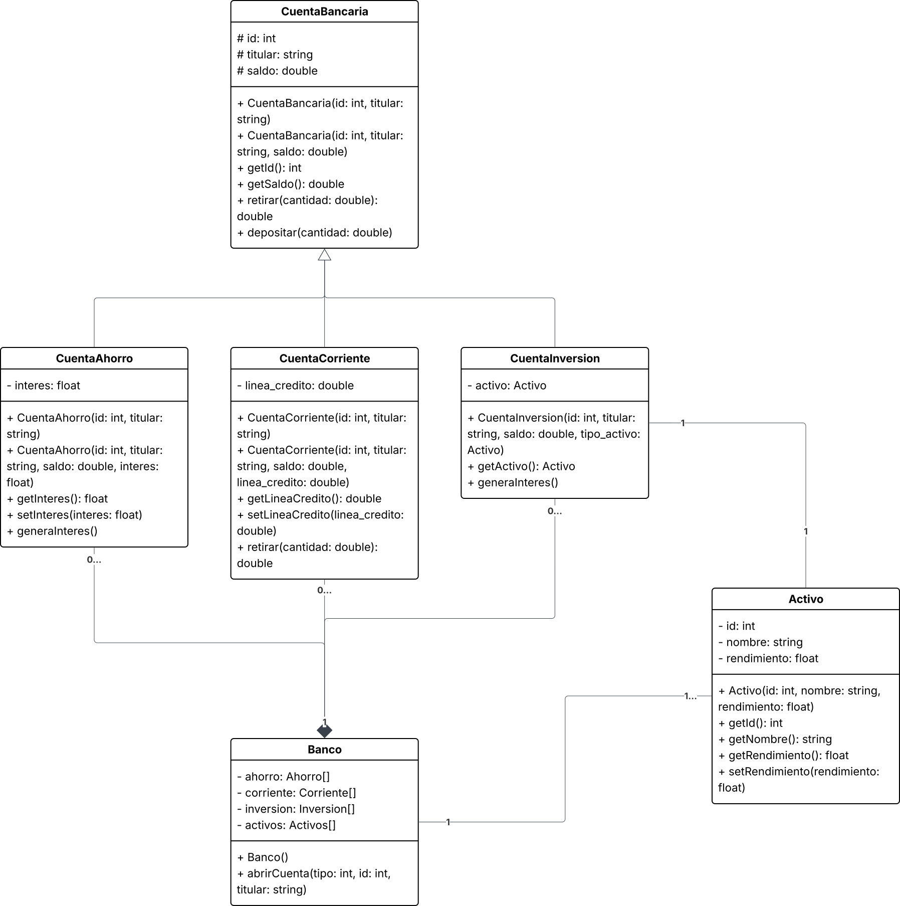

# Simulador de Banco

### Contexto

Un banco maneja distintos tipos de cuentas dependiendo de su uso y funcionalidad, en este programa existen cuentas corrientes, de ahorros y de inversión.
Este programa utiliza una estructura de clases para facilitar el manejo de los distintos tipos de cuentas. Todas las cuentas pueden hacer funciones como
depósitos y retiros, pero solo la de ahorros y la de inversión generan un interés. Solo la cuenta de inversión tiene accesso a instrumentos de inversión.

### Funcionalidad

El programa permite abrir nuevas cuentas y realizar operaciones con las distintas cuentas.
Se ejecuta en una terminal y cuenta con un menú inicial para seleccionar las distintas opciones.
Para usar el programa solo hay que seguir las instrucciones que aparecen en pantalla.

Al abrir una cuenta nueva se pueden seleccionar 3 tipos de cuentas: de ahorros, corriente (crédito) o de inversión.

Se pueden mostrar todas las cuentas con su información.

Todas las cuentas pueden hacer retiros y recibir depósitos.

Se pueden generar y aplicar los intereses para las cuentas que lo permiten (ahorro e inversión).

Se puede modificar el rendimiento de los distintos activos que maneja el banco.

### Diagrama de clases

### Consideraciones

El programa corre solamente en la terminal y esta escrito en [C++11](https://en.wikipedia.org/wiki/C++11) por lo que corre en todos los sistemas operativos.
Para compilar, se debe usar el compilador `g++`. Otros compiladores pueden funcionar, pero no se recomiendan.

### Estilo del código

Para el código se utiliza el formateador [ClangFormat](https://clang.llvm.org/docs/ClangFormat.html). En el archivo `.clang-format` se encuentra el estilo específico utilizado en este proyecto.

Para los comentarios, solo se incluyen cuando el código no se pueda entender de forma inmediata. Funcionamiento de getters y setters es prácticamente universal, por lo tanto solo se comentan si hacen algo aparte de solo regresar o asignar el valor correspondiente.

### Compilación e instalación

#### Linux

Compilación:
`g++ -std=c++11 main.cpp activo.cpp banco.cpp cuentaAhorro.cpp cuentaBancaria.cpp cuentaCorriente.cpp cuentaInversion.cpp -o banco`

Ejecución: `./banco`

#### Windows

Compilación:
`g++ -std=c++11 main.cpp activo.cpp banco.cpp cuentaAhorro.cpp cuentaBancaria.cpp cuentaCorriente.cpp cuentaInversion.cpp -o banco`

Ejecución: `.\banco.exe`

### Correcciones
En el avance 1 se mencionó un problema de compilación debido a las extensiones de archivo. En esta [commit](890f4ec218c075a14390526b000e272772dc601b) se arregla el problema al cambiar las extensiones `.cc` a `.cpp` y las `.hh` a `.hpp`.
